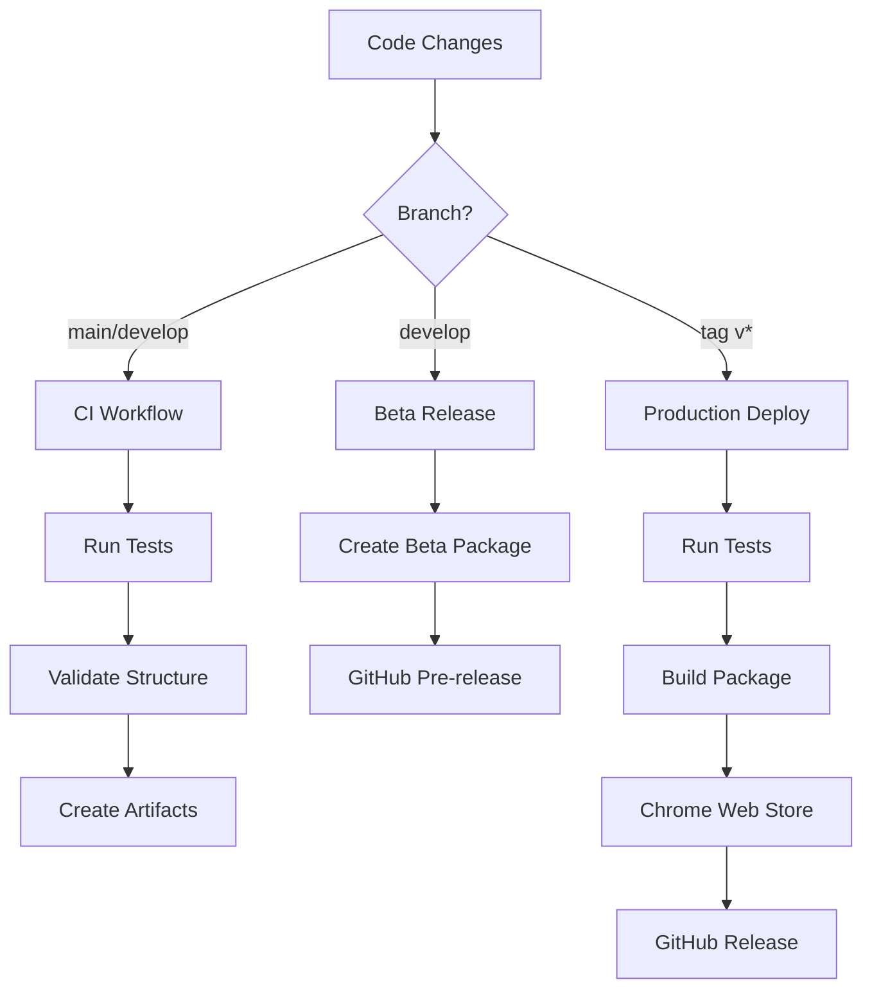

# GoFaster Chrome Extension - Documentation

Complete documentation for deploying and maintaining the GoFaster Chrome extension.

## 📚 Documentation Index

### 🚀 Deployment
- **[DEPLOYMENT.md](DEPLOYMENT.md)** - Complete deployment guide with step-by-step instructions
- **[DEPLOYMENT_CHEATSHEET.md](DEPLOYMENT_CHEATSHEET.md)** - Quick reference for common tasks
- **[MONITORING.md](MONITORING.md)** - How to monitor deployments and track metrics

### 🔧 Setup Files
- **[../.github/CHROME_WEBSTORE_SETUP.md](../.github/CHROME_WEBSTORE_SETUP.md)** - Chrome Web Store API setup
- **[../scripts/build.sh](../scripts/build.sh)** - Local build script

### ⚙️ Workflow Files
- **[../.github/workflows/chrome-webstore.yml](../.github/workflows/chrome-webstore.yml)** - Production deployment
- **[../.github/workflows/ci.yml](../.github/workflows/ci.yml)** - Continuous integration
- **[../.github/workflows/beta-release.yml](../.github/workflows/beta-release.yml)** - Beta releases

## 🎯 Quick Start

### First Time Setup
1. Read [DEPLOYMENT.md](DEPLOYMENT.md) sections 1-4
2. Configure GitHub secrets
3. Test with beta release

### Regular Deployment
1. Check [DEPLOYMENT_CHEATSHEET.md](DEPLOYMENT_CHEATSHEET.md)
2. Run: `git tag v1.0.0 && git push origin v1.0.0`
3. Monitor via [MONITORING.md](MONITORING.md) guidelines

## 🔄 Workflow Overview

## 📋 Common Tasks

| Task | Command | Documentation |
|------|---------|---------------|
| Production deploy | `git tag v1.0.0 && git push origin v1.0.0` | [DEPLOYMENT.md](DEPLOYMENT.md#method-1-automatic-recommended) |
| Beta release | `git push origin develop` | [DEPLOYMENT.md](DEPLOYMENT.md#method-3-betatesting) |
| Local build | `./scripts/build.sh` | [DEPLOYMENT.md](DEPLOYMENT.md#method-4-local-build-only) |
| Monitor status | Check GitHub Actions | [MONITORING.md](MONITORING.md#github-actions) |
| Troubleshoot | Check logs and docs | [DEPLOYMENT.md](DEPLOYMENT.md#troubleshooting) |

## 🚨 Emergency Procedures

### Deployment Failed
1. Check GitHub Actions logs
2. Review [DEPLOYMENT.md troubleshooting](DEPLOYMENT.md#troubleshooting)
3. Fix issues and retry

### Extension Rejected
1. Check Chrome Web Store feedback
2. Address policy violations
3. Resubmit via manual workflow

### Critical Bug in Production
1. Create hotfix branch
2. Deploy via manual workflow
3. Monitor via [MONITORING.md](MONITORING.md)

## 🔐 Security Checklist

- [ ] GitHub secrets configured correctly
- [ ] OAuth credentials rotated quarterly
- [ ] No sensitive data in code
- [ ] API quotas monitored
- [ ] Access permissions reviewed

## 📞 Support Resources

### Internal Documentation
- All documentation in this `/docs` folder
- Workflow files in `/.github/workflows/`
- Build scripts in `/scripts/`

### External Resources
- [Chrome Web Store Developer Dashboard](https://chrome.google.com/webstore/devconsole)
- [Google Cloud Console](https://console.cloud.google.com/)
- [GitHub Actions Documentation](https://docs.github.com/en/actions)
- [Chrome Extension Documentation](https://developer.chrome.com/docs/extensions/)

## 🔄 Maintenance Schedule

### Weekly
- Review deployment metrics
- Check user feedback
- Monitor workflow success rates

### Monthly
- Update dependencies
- Review API usage
- Rotate credentials (quarterly)

### Quarterly
- Full security review
- Documentation updates
- Workflow optimization

---

**Need help?** Start with the [DEPLOYMENT_CHEATSHEET.md](DEPLOYMENT_CHEATSHEET.md) for quick answers, then dive into [DEPLOYMENT.md](DEPLOYMENT.md) for detailed instructions.
